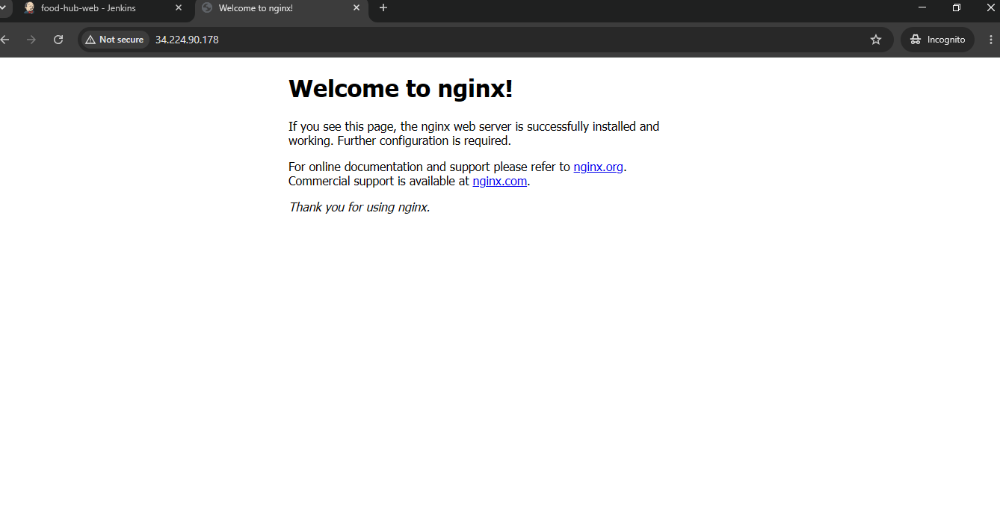
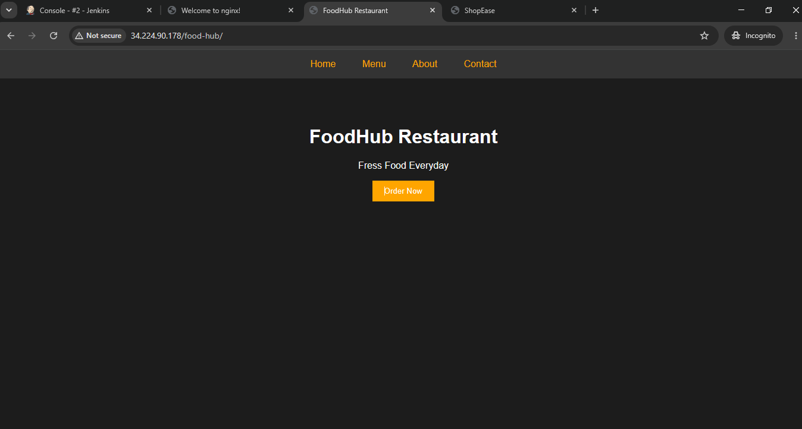
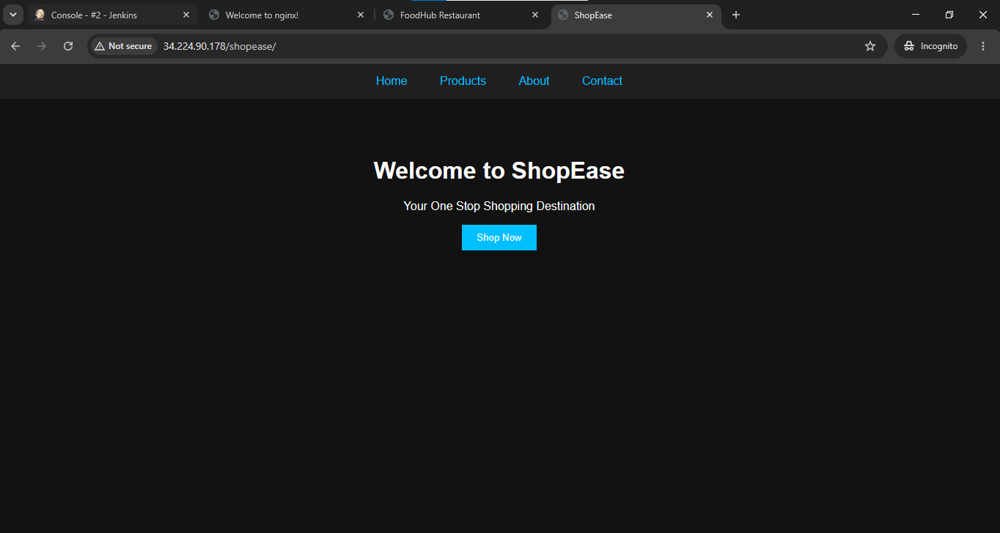
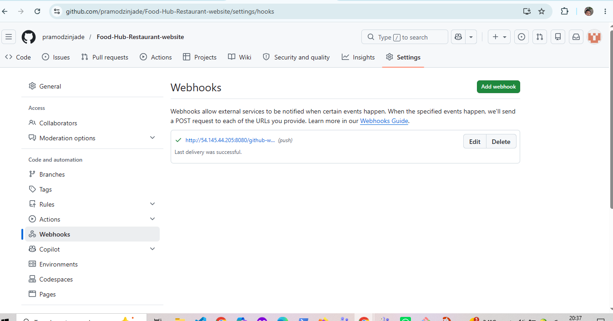
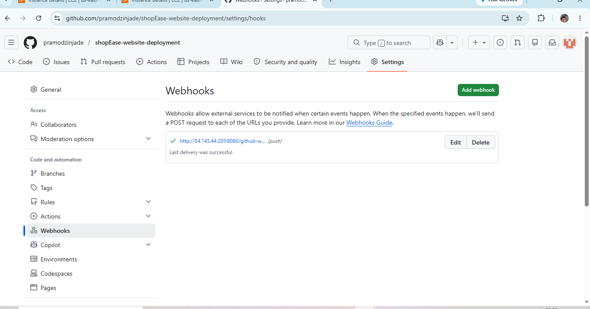

1. What is Jenkins mainly used for?

 ans. B) Continuous Integration and Continuous Delivery

2. Which type of job allows you to define build steps using code
in Jenkins?

ans. A)pipeline project

3.  Which file is used to define a pipeline in Jenkins?

 ans. C)jenkinsfile

4. What is the purpose of a Jenkins Agent (Node)?

 ans. B)To execute jobs assigned by the Jenkins controller

5. Which plugin is required to connect Jenkins with GitHub?

ans. B) Git Plugin

6. What is the purpose of a Webhook in Jenkins CI/CD?

ans. B) To trigger build automatically on code push

7. Which command is used inside Jenkins Pipeline to execute
shell commands?

ans. C) sh

8. What is the purpose of post block in Jenkins Pipeline?

ans. B) Execute steps after pipeline stages

9. What is the use of sshagent in Jenkins Pipeline?

ans. C) Use stored SSH credentials during execution

10.  What happens if a stage fails in Jenkins Pipeline (by default)?

ans. C)the pipeline stop execution

Jenkins CI/CD Practical Test

Project Overview

This project demonstrates how to automate the deployment of a static website using Jenkins CI/CD Pipeline. Whenever changes are pushed to the GitHub repository, Jenkins automatically pulls the latest code and deploys the website to the target server.

Automated CI/CD pipeline using Jenkins
Source code management with GitHub
Automatic deployment after code changes
Easy and fast website updates
Continuous Integration and Continuous Deployment

Application Repositories

Application 1: FoodHub Restaurant Website

[repository](https://github.com/pramodzinjade/Food-Hub-Restaurant-website.git)

Application 2: ShopEase Website

[repository](https://github.com/pramodzinjade/shopEase-website-deployment.git)

Task 1 :Infrastructure Setup

create two server jenkins master and target server

Jenkins Server
install jenkins
install java
nstall required plugins
Configure SSH credentials
Verify Jenkins is accessible via browser

Target Server
Install nginx
Open port 80
Ensure websites are accessible from browser

Task2 : Deploy Both Applications on the
Same Server

Expected url:
http://<Target-Server-IP>/foodhub
http://<Target-Server-IP>/shopease

Expected deployment paths:
/var/www/html/foodhub
/var/www/html/shopease

Task 3 Create Jenkins Pipeline Jobs
Create two separate Jenkins Pipeline jobs:
1. food-hub-pipeline

pipeline {
    agent any

    environment {
        SSH_CRED = 'food-hub-web'      // Jenkins SSH credential ID
        SERVER_IP = '172.31.27.73'        // Target server IP
        REMOTE_USER = 'ubuntu'
        APP_DIR = '/var/www/html/food-hub'
    }

    stages {

        stage('Clone Repository') {
            steps {
                git branch: 'main',
                url: 'https://github.com/pramodzinjade/Food-Hub-Restaurant-website.git'
            }
        }

        stage('Deploy Website') {
            steps {
                sshagent(credentials: ["${SSH_CRED}"]) {

                    sh '''
                    ssh -o StrictHostKeyChecking=no ${REMOTE_USER}@${SERVER_IP} "
                        sudo mkdir -p ${APP_DIR}
                    "

                    scp -o StrictHostKeyChecking=no -r * \
                    ${REMOTE_USER}@${SERVER_IP}:/tmp/static-site

                    ssh -o StrictHostKeyChecking=no ${REMOTE_USER}@${SERVER_IP} "
                        sudo rm -rf ${APP_DIR}/*
                        sudo cp -r /tmp/static-site/* ${APP_DIR}/
                        sudo chown -R www-data:www-data ${APP_DIR}
                    "
                    '''
                }
            }
        }

        stage('Verify Deployment') {
            steps {
                sh '''
                echo "Website deployed successfully!"
                '''
            }
        }
    }
}

2. shopease-pipeline

pipeline {
    agent any

    environment {
        SSH_CRED = 'shop-ease-web'      // Jenkins SSH credential ID
        SERVER_IP = '172.31.27.73'        // Target server IP
        REMOTE_USER = 'ubuntu'
        APP_DIR = '/var/www/html/shopEase'
    }

    stages {

        stage('Clone Repository') {
            steps {
                git branch: 'main',
                url: 'https://github.com/pramodzinjade/shopEase-website-deployment.git'
            }
        }

        stage('Deploy Website') {
            steps {
                sshagent(credentials: ["${SSH_CRED}"]) {

                    sh '''
                    ssh -o StrictHostKeyChecking=no ${REMOTE_USER}@${SERVER_IP} "
                        sudo mkdir -p ${APP_DIR}
                    "

                    scp -o StrictHostKeyChecking=no -r * \
                    ${REMOTE_USER}@${SERVER_IP}:/tmp/static-site

                    ssh -o StrictHostKeyChecking=no ${REMOTE_USER}@${SERVER_IP} "
                        sudo rm -rf ${APP_DIR}/*
                        sudo cp -r /tmp/static-site/* ${APP_DIR}/
                        sudo chown -R www-data:www-data ${APP_DIR}
                    "
                    '''
                }
            }
        }

        stage('Verify Deployment') {
            steps {
                sh '''
                echo "Website deployed successfully!"
                '''
            }
        }
    }
}

output :
1. foodHub

2. shopease

Task 4 Configure Github webhooks
Configured Github webhooks on both repositoray

Now any push automatically triggers jenkins

